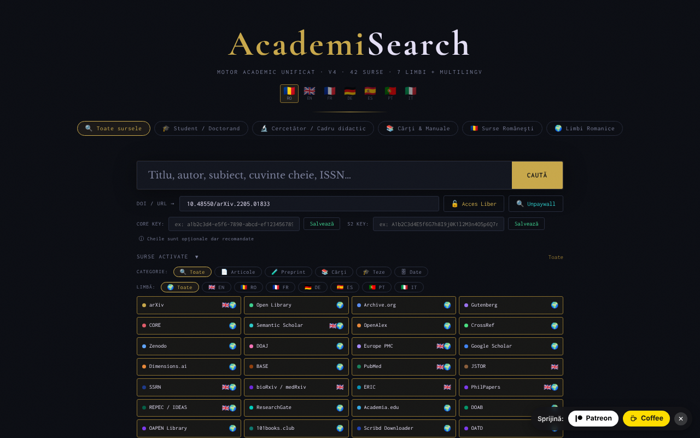

# AcademiSearch

Motor de căutare academic unificat, într-un singur fișier HTML: 42 de surse open-access, 7 limbi de interfață.

**Live:** https://chiuta.github.io/AcademiSearch/

## Ce este

AcademiSearch este o aplicație dintr-un singur fișier `index.html` care interoghează simultan mai multe surse academice (articole, preprinturi, cărți, teze, date de cercetare) și afișează rezultatele într-o fereastră comună. Pentru o parte din surse rezultatele sunt aduse direct prin API; pentru restul aplicația oferă link direct către pagina de căutare a portalului respectiv. Conform textului din aplicație, sunt 42 de surse: 11 cu rezultate live prin API și 31 de portaluri cu link direct.

## Funcții

- Interfață în 7 limbi: română, engleză, franceză, germană, spaniolă, portugheză, italiană (butoane RO / EN / FR / DE / ES / PT / IT).
- Presetări de căutare: „Toate sursele", „Student / Doctorand", „Cercetător / Cadru didactic", „Cărți & Manuale", „Surse Românești", „Limbi Romanice".
- Panou „Surse activate" cu bifarea individuală a surselor.
- Filtre după categorie (Articole, Preprint, Cărți, Teze, Date) și după limbă (EN, RO, FR, DE, ES, PT, IT).
- Rezultate cu filtre „Cu PDF" și „Cu DOI" și încărcare progresivă a rezultatelor.
- Câmp „DOI / URL" cu butoanele „Acces Liber" și „Unpaywall": aplicația caută o versiune open-access prin CrossRef (dacă lipsește DOI-ul), Unpaywall, OpenAIRE și căutare după titlu în Unpaywall.
- Câmpuri opționale pentru cheie API CORE și cheie API Semantic Scholar.
- Fereastră „Termeni legali & GDPR".

## Manual de utilizare

1. Deschideți pagina și alegeți limba interfeței din colțul de sus (RO, EN, FR, DE, ES, PT, IT).
2. Alegeți o presetare (de exemplu „Student / Doctorand") sau deschideți „Surse activate" și bifați manual sursele dorite.
3. Opțional, restrângeți după CATEGORIE și LIMBĂ.
4. Scrieți termenul în câmpul de căutare și apăsați Enter sau butonul „CAUTĂ".
5. În fereastra de rezultate folosiți filtrele „Cu PDF" / „Cu DOI"; închideți cu „Închide" sau tasta Escape.
6. Pentru un articol cunoscut, lipiți DOI-ul sau URL-ul în câmpul „DOI / URL" și apăsați „Acces Liber" (sau „Unpaywall").
7. Pentru CORE și Semantic Scholar puteți introduce cheia API și apăsați „Salvează" (cheile sunt opționale).

## Confidențialitate și rețea

- Local: limba interfeței se păstrează în `localStorage` (`ui_lang`); cheile API introduse se păstrează în `sessionStorage` și dispar la închiderea filei. Aplicația nu folosește cookie-uri.
- Rețea: aplicația NU este offline. La fiecare căutare, termenul căutat este trimis către serviciile externe active, direct din browser: OpenAlex, CrossRef, CORE, Semantic Scholar, arXiv, Europe PMC (ebi.ac.uk), DOAJ, Zenodo, Open Library, Internet Archive, Project Gutenberg (gutendex.com). La „Acces Liber" / „Unpaywall" sunt contactate CrossRef, Unpaywall și OpenAIRE.
- Dacă browserul blochează cererea directă (CORS) către arXiv sau Semantic Scholar, cererea trece prin proxy-ul public `api.allorigins.win`, care poate vedea URL-ul interogării. Din panoul „Surse activate" se pot dezactiva aceste două surse.
- Cererile către OpenAlex și Unpaywall includ adresa de contact a operatorului (`academisearch@alexio.tf`), conform convenției „polite pool".
- Portalurile cu link direct sunt contactate doar dacă deschideți linkul.
- Fonturi/CDN: verificat la audit (2026-10-10): nu există scripturi, fonturi sau stiluri încărcate de la CDN; fonturile sunt integrate, iar politica CSP din pagină (`connect-src`) limitează cererile la gazdele de mai sus.

## Rulare locală / offline

Descărcați `index.html` și deschideți-l în browser. Interfața pornește local, dar căutarea necesită conexiune la internet.

## Licență

CC0 1.0 Universal (domeniu public) — vezi fișierul LICENSE

## Autor

Alexio — Alexandru-Ionuț Chiuță, contact: alexio@trom.tf

## English summary

AcademiSearch is a single-file HTML meta-search tool over 42 open-access academic sources (11 with live API results, 31 as direct-link portals), with a 7-language UI. It is not offline: searches go directly from the browser to third-party APIs, and arXiv/Semantic Scholar may fall back to the allorigins.win CORS proxy. Only the UI language (localStorage) and optional API keys (sessionStorage) are stored. CC0 licence.

Audit: 2026-10-10 — verificat codul (cereri de rețea, escapare rezultate API, proxy CORS: cheile API se trimit doar în antet direct, niciodată prin proxy), accesibilitate (axe) și funcționarea (căutare offline: erori de sursă gestionate). Numărul „42 de surse” corespunde: 11 API + 31 portaluri.
